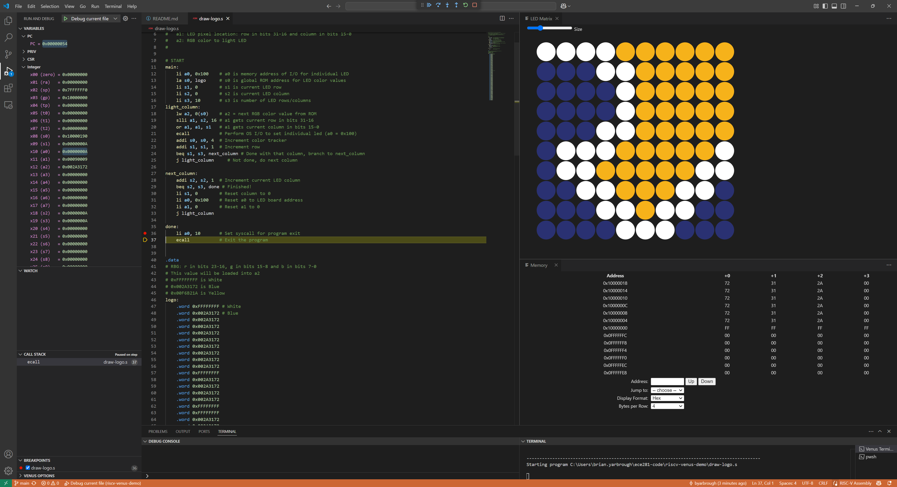

# ICE7: RISC-V VS Code Venus Demo

Draw the RISC-V Logo with the [VS Code Venus Simulator](https://marketplace.visualstudio.com/items?itemName=hm.riscv-venus) LED Matrix.

Simply clone, open in VS Code, install the recommended plugins:
- [hm.riscv-venus](https://marketplace.visualstudio.com/items/?itemName=hm.riscv-venus)
- [zhwu95.riscv](https://marketplace.visualstudio.com/items/?itemName=zhwu95.riscv)

Then **Run** and **Start Debugging**!

- If the LED Matrix doesn't automatically open, use **Ctrl+Shift+P** then `Venus: Open LED Matrix`.
- Open the Memory Browsewr with **Ctrl+Shift+P** then `Venus: Open Memory`.
- When debugging, registers are shown in **Variables > Integer**.

## Documentation

- The example code is from [the ledmatrix example](https://github.com/hm-riscv/vscode-riscv-venus/tree/main/examples/ledmatrix).
- Comments were added based off [VS Code RISC-V Venus README](https://github.com/hm-riscv/vscode-riscv-venus?tab=readme-ov-file#led-matrix).
